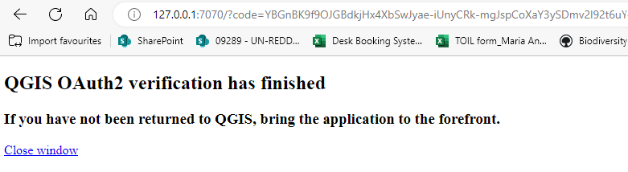
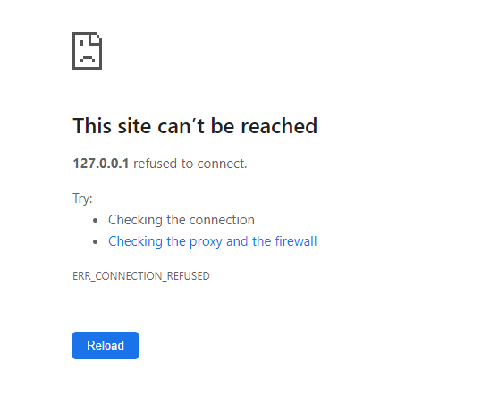

# UNEP-WCMC map templates for QGIS

## Connect QGIS to portal using oauth2 authentication

*Original source based on https://north-road.com/2022/09/16/securely-accessing-arcgis-online-agol-and-enterprise-arcgis-portal-sites-through-qgis-2022-update/*

### 1. Download files from GitHub

 - Click on the green 'Code' button and click 'Download ZIP' (if you are a GitHub user you can alternatively choose to oprn with GitHub Desktop)
- Save the Zip file to a folder on your computer. 
- Navigate to the folder and unzip the file.
- In here you will find the files from this repository.

### 2. Copy the QGIS portal authorisation file to the QGIS profiles folder
- In a windows explorer window copy the downloaded file to your QGIS profiles folder located in AppData
*(Note: if you can’t see the folder you may need to tell your windows explorer to be able to see hidden folder by going to View >>>show hidden items)*
e.g. your QGIS profile folder should be in your user AppData folder i.e.  C:\Users\Corinnar\AppData\Roaming\QGIS\QGIS3\profiles\default

### 3. Set up the portal connection in QGIS

- Open QGIS
- Navigate to **Layers>>Data Source Manager**

   

 - Click on ArcGIS REST Server in the left hand panel and then click New

     
  
- Fill out the following parameters
  
  **Name:** UNEP-WCMC portal
  
  **URL:** https://data-gis.unep-wcmc.org/server/rest/services/

  **Community endpoint URL:** https://data-gis.unep-wcmc.org/portal/sharing/rest/community/

  **Content endpoint URL:** https://data-gis.unep-wcmc.org/portal/sharing/rest/content/

- In the new window enter the following parameter
  
  **Name:** UNEP-WCMC portal

  **Resource:** https://data-gis.unep-wcmc.org/portal/sharing/rest/

- In the box underneath resource pick **Oauth2 authentication**
  
- In the row labelled grant flow Click the blue down arrow button

  
  
- Navigate to the gis profile folder where you placed the authentication file and select the file.  
i.e. C:\Users\Corinnar\AppData\Roaming\QGIS\QGIS3\profiles\default\QGIS_oauth2_UNEP_WCMC.json

  

- Click save
  
- Under Authentications click you should now see UNEP-WCMC Portal (Oauth2)

    

- Click ok to close
- This will take you back to the Data Source Manager Window.
- Click Connect

   
  
- You should see two items (Groups and Services) under UNEP-WCMC portal

   

- Click on the  > arrow to expand Services
- This will take you to the UNEP-WCMC portal login page

   

- Once logged it you should get the message saying the authentication has worked and you can go back to QGIS.
  
   
  
- you should not see this
  
  
  
- If connection has worked see all the data layers in the portal which you can add directly into your QGIS project in the same way as shapefiles, geodatabase files and geotiff raster layers.

    

4. Connect QGIS to portal using oauth2 token
   *(you will only need this if step 3 failed)*

   *(original source: based on https://toolkit.data.wa.gov.au/hc/en-gb/articles/360001044975-How-to-Add-an-ArcGIS-Server-Feature-Service-Esri-Token-Authentication-in-QGIS#connecting-to-a-service-using-token-authentication)*

   - If the Oauth2 did not work this is an alternative method. Let Corinna or Osgur know if you get an error still and can’t connect using Oauth2 as it is useful to know during this testing phase when and why iot is not working. Then try the steps below. 

 - You can generate a token which you can specify will last from 1 hour to 2 weeks. After the specified time you will need to repeat this process to generate a new token
- Navigate to this website https://data-gis.unep-wcmc.org/portal/sharing/rest/oauth2
- click on generate token

    

- Login with your portal login
- Click IP Address of this request’s origin
- And click Generate Token

    

- The token will appear underneath

      

- Copy the token and return to QGIS
- Go back to the Data Source Manager and this time edit the UNEP-WCMC Portal connection that you already tried to set up

    

- Click on the Green plus button

    

- A new Authentication window opens. 
- Give the new authentication a name e.g. UNEP-WCMC portal token
- Change the dropdown from Basic Authentication to ESRI token
- Paste your token in the box and click Save

    

- Your authentication should now be set to the ESRI Token – click ok

    

- You should now be back at the Data Source Manager.
- Click Connect
- You should see the same as you did when you tried to connect via the Oauth2 method

    
  
- You should see two items (Groups and Services) under UNEP-WCMC portal

    
  
- Click on the  > arrow to expand Services
- You should see all the data layers appear!!

    

- Let Corinna or Osgur know if you get an error still and can’t connect

